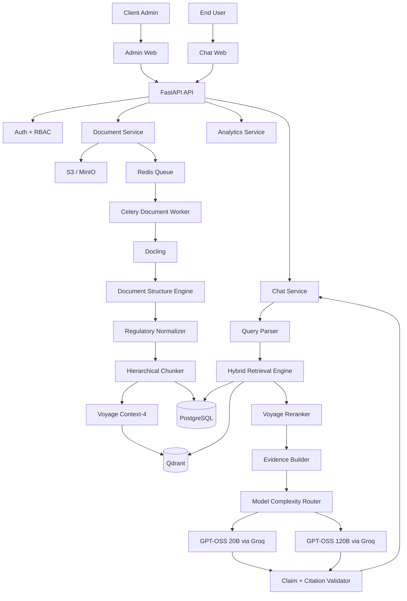
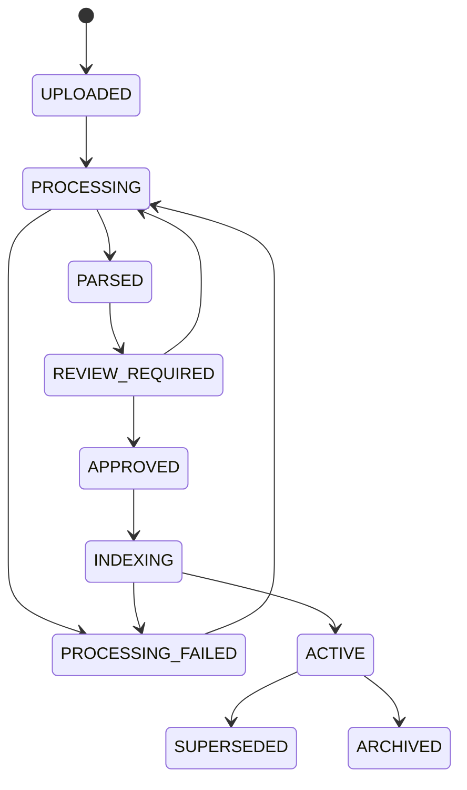
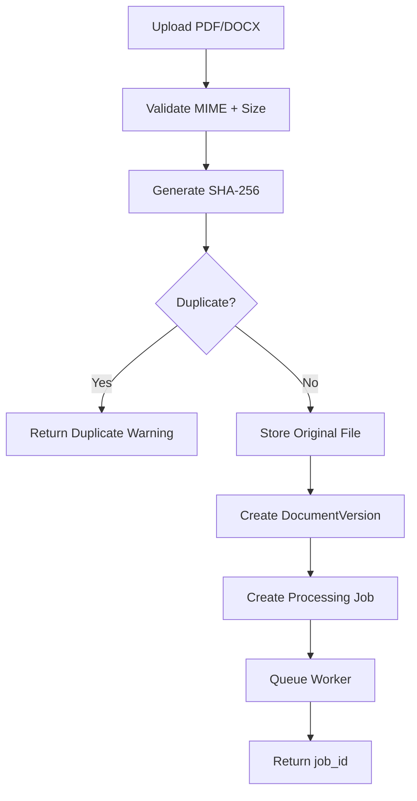
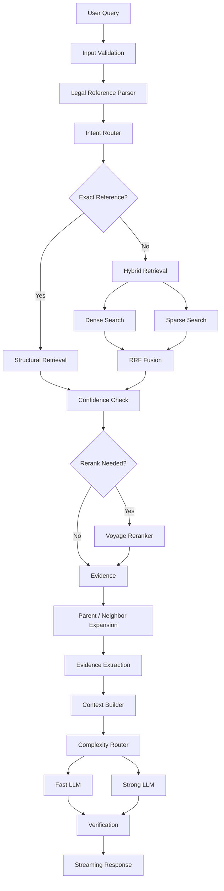
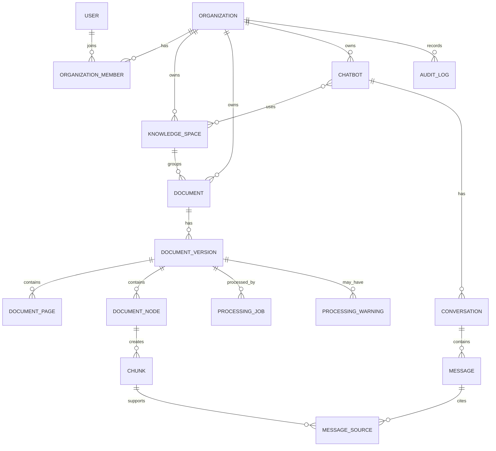

# MASTER DEVELOPMENT SPECIFICATION
## Self-Service Regulatory Knowledge Assistant
### Adaptive Structure-Aware Contextual Hybrid RAG

**Status:** Final Development Reference  
**Version:** 1.0  
**Purpose:** Menjadi acuan utama selama seluruh proses development, testing, deployment, dan evaluasi sistem.  
**Language:** Bahasa Indonesia  
**Architecture Priority:** Accuracy → Traceability → Security → Reliability → Latency → Cost Efficiency → Feature Complexity

---

# 1. TUJUAN DOKUMEN

Dokumen ini adalah sumber acuan teknis utama untuk membangun **Self-Service Regulatory Knowledge Assistant**, yaitu platform chatbot berbasis dokumen regulasi yang:

1. Memungkinkan client mengunggah sendiri dokumen dari sisi admin.
2. Tidak mengharuskan developer mengetahui dokumen terlebih dahulu.
3. Tidak mengharuskan struktur dokumen seragam.
4. Mampu memahami dokumen regulasi dengan struktur yang berbeda-beda.
5. Mengubah dokumen menjadi knowledge base terstruktur.
6. Menjawab pertanyaan hanya berdasarkan evidence dari dokumen aktif.
7. Menghasilkan jawaban yang dapat ditelusuri sampai dokumen, bagian, pasal, ayat, huruf, dan halaman jika tersedia.
8. Menjaga konteks percakapan dalam satu sesi.
9. Tidak mencampurkan konteks antar sesi percakapan.
10. Memberikan respons cepat melalui retrieval yang efisien, model routing, dan streaming.
11. Menggunakan cloud LLM, tanpa local LLM.
12. Tidak menggunakan GraphRAG.
13. Tidak menggunakan fine-tuning sebagai mekanisme utama knowledge ingestion.
14. Menggunakan arsitektur multi-tenant sejak awal.

Dokumen ini harus dianggap sebagai **source of truth development**. Jika implementasi berbeda dari keputusan di dokumen ini, perubahan wajib dicatat melalui ADR atau revisi versi dokumen ini.

---

# 2. PRODUCT DEFINITION

## 2.1 Nama Konseptual Produk

**Self-Service Regulatory Knowledge Assistant**

Alternatif positioning:

> AI regulatory assistant yang memberikan jawaban terverifikasi dan dapat ditelusuri langsung ke dokumen, struktur regulasi, dan halaman sumber.

Produk **bukan** sekadar:

- chatbot PDF,
- semantic search,
- wrapper LLM,
- question-answering berbasis upload file,
- GraphRAG application.

Produk adalah:

```text
CLIENT DOCUMENTS
      ↓
ADAPTIVE DOCUMENT UNDERSTANDING
      ↓
STRUCTURAL NORMALIZATION
      ↓
VERIFIED KNOWLEDGE BASE
      ↓
HYBRID LEGAL RETRIEVAL
      ↓
EVIDENCE-FIRST GENERATION
      ↓
TRACEABLE ANSWER
```

---

# 3. CORE PRINCIPLES

## 3.1 Evidence First

Urutan sistem wajib:

```text
QUESTION
↓
RETRIEVAL
↓
EVIDENCE
↓
VALIDATION
↓
GENERATION
↓
CLAIM CHECK
↓
CITATION
↓
ANSWER
```

Tidak boleh:

```text
QUESTION
↓
LLM KNOWLEDGE
↓
ANSWER
↓
MENCARI CITATION
```

LLM **bukan source of truth**.

Source of truth adalah dokumen client yang berstatus aktif.

---

## 3.2 No Hallucination by Design

Sistem dilarang mengarang:

- nomor regulasi,
- judul dokumen,
- nomor pasal,
- nomor ayat,
- nomor huruf,
- tanggal,
- tahapan,
- sanksi,
- persyaratan,
- kewenangan,
- prosedur,
- dasar hukum,
- status berlaku atau tidak berlaku.

Jika evidence tidak cukup, sistem harus mengatakan:

> Informasi tersebut belum ditemukan pada dokumen yang tersedia dalam basis pengetahuan saat ini.

Jangan otomatis mengatakan:

> Tidak ada aturan mengenai hal tersebut.

Perbedaan ini penting.

---

## 3.3 Structured First

Untuk dokumen regulasi:

```text
STRUCTURE
>
SEMANTIC
>
TOKEN LIMIT
```

Chunking harus mengikuti struktur dokumen jika struktur dapat ditemukan.

---

## 3.4 Deterministic Before LLM

Jika masalah bisa diselesaikan menggunakan:

- regex,
- metadata,
- parser,
- database filter,
- exact lookup,
- state machine,

jangan memanggil LLM.

Contoh:

```text
"Pasal 17 ayat 2"
```

harus diproses menggunakan legal reference parser sebelum semantic search atau LLM.

---

## 3.5 Provider Neutral

Business logic tidak boleh terikat pada provider tertentu.

Gunakan:

- `LLMGateway`
- `EmbeddingGateway`
- `RerankerGateway`

Provider dan model dipilih melalui konfigurasi.

---

# 4. FINAL TECHNOLOGY DECISIONS

| Area | Final Decision |
|---|---|
| Frontend | Next.js + TypeScript |
| UI | Tailwind CSS + shadcn/ui |
| Backend | FastAPI + Python |
| ORM | SQLAlchemy |
| Validation | Pydantic |
| Migration | Alembic |
| Primary DB | PostgreSQL |
| Vector DB | Qdrant |
| Cache / Queue | Redis |
| Worker | Celery |
| Object Storage | S3-compatible |
| Dev Object Storage | MinIO |
| Document Parser | Docling |
| OCR | Selective fallback |
| RAG | Adaptive Structure-Aware Contextual Hybrid RAG |
| Dense Retrieval | Contextual embedding |
| Dense Embedding | Voyage Context-4 |
| Sparse Retrieval | BM25 / sparse vector |
| Fusion | Reciprocal Rank Fusion |
| Reranker | Voyage rerank-2.5-lite |
| Exact Legal Lookup | PostgreSQL metadata / structural index |
| Main LLM Gateway | Hugging Face Inference Providers |
| Fast LLM | GPT-OSS 20B via Groq |
| Strong LLM | GPT-OSS 120B via Groq |
| Fast Fallback | provider murah lain melalui HF |
| Strong Fallback | provider murah lain melalui HF |
| Streaming | SSE |
| GraphRAG | Tidak digunakan |
| Neo4j | Tidak digunakan |
| Fine-tuning | Tidak digunakan |
| Local LLM | Tidak digunakan |

---

# 5. HIGH LEVEL ARCHITECTURE



---

# 6. PRODUCT ACTORS

## 6.1 End User

Dapat:

- membuat chat baru,
- melihat histori chat,
- melanjutkan percakapan,
- bertanya berdasarkan dokumen,
- melihat source,
- membuka source panel,
- membuka halaman dokumen,
- memberi feedback.

Tidak dapat:

- mengubah metadata dokumen,
- menghapus knowledge,
- mengubah status dokumen,
- melihat dokumen restricted tanpa izin.

---

## 6.2 Admin

Dapat:

- upload dokumen,
- melihat status pemrosesan,
- review metadata,
- review struktur,
- melihat warning,
- approve,
- publish,
- archive,
- replace document,
- delete,
- test knowledge,
- melihat analytics,
- melihat knowledge gaps,
- mengelola user sesuai role.

---

# 7. MULTI-TENANT ARCHITECTURE

Struktur:

```text
Organization
├── Knowledge Spaces
├── Documents
├── Chatbots
├── Users
└── Conversations
```

Setiap data penting wajib memiliki:

```text
organization_id
tenant_id
```

Jika relevan:

```text
knowledge_space_id
chatbot_id
```

Setiap query Qdrant wajib menggunakan tenant filter.

Tidak boleh ada retrieval tanpa tenant scope.

Contoh mandatory filter:

```text
tenant_id = CURRENT_TENANT
AND
knowledge_space_id IN ACTIVE_SPACES
AND
visibility IN USER_ALLOWED_VISIBILITY
AND
document_status = ACTIVE
```

Tenant isolation dianggap sebagai **security boundary**.

---

# 8. KNOWLEDGE SPACE

Knowledge Space digunakan untuk mengelompokkan dokumen.

Contoh:

```text
Pendidikan
Kepegawaian
Regulasi
SOP
Keuangan
Organisasi
```

Chatbot dapat menggunakan satu atau lebih Knowledge Space.

Contoh:

```text
Chatbot Pendidikan
├── Pendidikan
└── SOP

Chatbot Internal
├── Kepegawaian
├── Regulasi
└── SOP
```

---

# 9. DOCUMENT LIFECYCLE

Status utama:

```text
UPLOADED
PROCESSING
PARSED
REVIEW_REQUIRED
APPROVED
INDEXING
ACTIVE
PROCESSING_FAILED
SUPERSEDED
ARCHIVED
```

State flow:



Dokumen hanya boleh digunakan oleh chatbot jika:

```text
status = ACTIVE
```

---

# 10. DOCUMENT UPLOAD FLOW



Upload endpoint tidak boleh menunggu seluruh document processing selesai.

---

# 11. ADAPTIVE DOCUMENT INGESTION

## 11.1 Problem

Developer tidak mengetahui:

- bentuk regulasi,
- struktur,
- urutan heading,
- formatting,
- apakah digital atau scan,
- apakah ada lampiran,
- apakah menggunakan BAB/Pasal,
- apakah berbentuk keputusan,
- apakah berbentuk SOP.

Karena itu sistem tidak boleh menggunakan fixed-template parser.

---

## 11.2 Adaptive Parsing Pipeline

```text
FILE
↓
File Inspection
↓
Page Classification
↓
Primary Parsing
↓
Quality Evaluation
↓
Fallback jika diperlukan
↓
Generic Document Tree
↓
Regulatory Structure Induction
↓
Canonical Legal AST
↓
Hierarchical Chunking
↓
Embedding + Indexing
```

---

# 12. ADAPTIVE PAGE ROUTING

Setiap halaman diklasifikasikan:

```text
DIGITAL_TEXT
SCANNED
TABLE_HEAVY
LAYOUT_COMPLEX
IMAGE_HEAVY
UNKNOWN
```

Contoh:

```text
Page 1 → DIGITAL_TEXT
Page 2 → DIGITAL_TEXT
Page 3 → SCANNED
Page 4 → TABLE_HEAVY
Page 5 → DIGITAL_TEXT
```

Jangan memproses seluruh file dengan satu strategi jika tidak diperlukan.

---

# 13. PARSER CASCADE

```text
LEVEL 1
Docling / Native Parsing
↓
Quality Check
↓
GOOD?
├── YES → ACCEPT
└── NO
    ↓
LEVEL 2
Enhanced Layout Processing
↓
Quality Check
↓
GOOD?
├── YES → ACCEPT
└── NO
    ↓
LEVEL 3
OCR / VLM fallback
↓
Normalized Result
```

Prinsip:

```text
cheap-first
escalate-when-needed
```

---

# 14. GENERIC DOCUMENT TREE

Sistem selalu menghasilkan generic tree.

Node yang dapat digunakan:

```text
Document
Section
Subsection
Heading
Paragraph
List
ListItem
Table
Figure
Footnote
Appendix
UnknownBlock
```

Minimal data node:

```text
id
parent_id
node_type
sequence_number
text
normalized_text
page_start
page_end
bounding_box
confidence
source_provenance
```

Generic tree tetap tersedia walaupun regulatory parser gagal.

---

# 15. REGULATORY STRUCTURE LAYER

Possible regulatory nodes:

```text
DocumentIdentity
Preamble
Menimbang
Mengingat
Chapter
Part
Section
Article
Clause
Letter
NumberItem
Decision
Appendix
Table
Closing
```

Semua node optional.

Contoh regulasi:

```text
LegalDocument
├── Identity
├── Preamble
│   ├── Menimbang
│   └── Mengingat
├── Body
│   ├── BAB
│   │   ├── Bagian
│   │   │   └── Pasal
│   │   │       ├── Ayat
│   │   │       └── Huruf
└── Lampiran
```

Contoh keputusan:

```text
LegalDocument
├── Identity
├── Preamble
└── Decision
    ├── KESATU
    ├── KEDUA
    └── KETIGA
```

Contoh SOP:

```text
Document
├── Tujuan
├── Ruang Lingkup
├── Definisi
├── Prosedur
└── Lampiran
```

---

# 16. STRUCTURE DETECTION SIGNALS

Gunakan kombinasi:

- regex,
- numbering pattern,
- typography,
- font size,
- bold,
- indentation,
- alignment,
- reading order,
- bounding box,
- surrounding block,
- layout cues,
- LLM/VLM fallback.

Contoh pattern:

```text
BAB I
BAB II

Pasal 1
Pasal 17

(1)
(2)

a.
b.

KESATU:
KEDUA:

I.
II.

A.
B.

1.
2.
```

Regex bukan satu-satunya source of truth.

---

# 17. CONFIDENCE MODEL

Contoh:

```json
{
  "node_type": "article",
  "text": "Pasal 17",
  "confidence": 0.99
}
```

Threshold awal:

```text
>= 0.90
HIGH

0.70 - 0.89
MEDIUM

< 0.70
REVIEW_REQUIRED
```

Threshold harus configurable.

Admin hanya perlu review anomaly dan low-confidence item.

---

# 18. DOCUMENT METADATA

Jika tersedia, extract:

```text
document_type
document_number
document_title
year
issuing_authority
issue_date
effective_date
expiration_date
legal_status

category
topic
department
audience

chapter_number
chapter_title

section_number
section_title

article_number
clause_number
letter_number

appendix
table_number

page_start
page_end
```

AI-generated metadata harus dapat diedit admin.

---

# 19. DOCUMENT VERSIONING

Pisahkan:

```text
Document
DocumentVersion
```

Contoh:

```text
SOP Pendidikan
├── Version 1
├── Version 2
└── Version 3
```

DocumentVersion fields:

```text
id
document_id
version_number
file_hash
created_at
effective_from
effective_until
status
storage_path
```

---

# 20. DOCUMENT VALIDITY

Possible status:

```text
ACTIVE
SUPERSEDED
REVOKED
DRAFT
ARCHIVED
UNKNOWN
```

LLM tidak boleh menentukan status regulasi sendiri.

Status berasal dari metadata atau admin.

Retriever memprioritaskan dokumen ACTIVE.

---

# 21. DOCUMENT RELATIONSHIPS

Walaupun GraphRAG tidak digunakan, relational metadata boleh menyimpan hubungan:

```text
AMENDS
REPEALS
REPLACES
IMPLEMENTS
REFERS_TO
SUPERSEDED_BY
```

Disimpan di PostgreSQL.

Tidak perlu Neo4j.

---

# 22. HIERARCHICAL CHUNKING

Prioritas:

```text
LEGAL STRUCTURE
>
SEMANTIC STRUCTURE
>
TOKEN LIMIT
```

Contoh:

```text
Pasal pendek
→ 1 chunk

Pasal panjang
→ parent Pasal
→ child per Ayat

Ayat terlalu panjang
→ semantic/token subdivision
```

Jangan fixed 500-token chunking sebagai metode utama.

---

# 23. PARENT CHILD MODEL

Chunk minimal:

```text
chunk_id
parent_chunk_id
previous_chunk_id
next_chunk_id

document_id
document_version_id

source_node_id
sequence_number

page_start
page_end

original_text
contextual_text
semantic_summary
```

Neighbor expansion dilakukan jika relevan.

Jangan selalu mengambil previous dan next chunk tanpa reason.

---

# 24. CONTENT REPRESENTATIONS

## 24.1 Original Text

Immutable.

Digunakan untuk:

- evidence,
- citation,
- quote,
- verification.

---

## 24.2 Contextual Text

Contoh:

```text
Dokumen:
Peraturan X Nomor 7 Tahun 2026

BAB:
Penyelenggaraan

Pasal:
17

Ayat:
2

Isi:
[original text]
```

Digunakan untuk dense embedding.

---

## 24.3 Semantic Summary

Opsional.

Digunakan untuk retrieval enrichment.

Tidak boleh digunakan sebagai evidence final.

---

# 25. TABLE HANDLING

Table dianggap first-class knowledge.

Simpan:

```text
table_id
headers
rows
cells
caption
page
bounding_box
```

Buat:

- structured representation,
- textual representation.

Citation tetap menunjuk source table asli.

---

# 26. APPENDIX HANDLING

Lampiran tidak dianggap appendix yang diabaikan.

Lampiran dapat berisi:

- kurikulum,
- tarif,
- jadwal,
- kompetensi,
- template,
- daftar,
- tabel,
- prosedur.

Struktur:

```text
Document
└── Appendix
    ├── Section
    ├── Table
    ├── List
    └── Content
```

---

# 27. PROVENANCE

Setiap answer harus bisa ditelusuri:

```text
Answer
↓
Claim
↓
Source ID
↓
Chunk
↓
Document Node
↓
Page
↓
Document Version
↓
Original File
```

Jika tersedia, simpan:

```text
page
bounding_box
original_text
source_node_id
document_version_id
```

---

# 28. FINAL RAG TYPE

**Adaptive Structure-Aware Contextual Hybrid RAG**

Pipeline:

```text
Adaptive Parsing
↓
Structure-Aware Chunking
↓
Contextual Embedding
↓
Dense Index
+
Sparse Index
+
Structural Metadata Index
↓
Query Router
↓
Hybrid Retrieval
↓
RRF
↓
Conditional Reranking
↓
Parent / Neighbor Expansion
↓
Evidence Extraction
↓
Context Builder
↓
Cloud LLM
↓
Claim Verification
↓
Citation Validation
```

Tidak ada GraphRAG.

---

# 29. RETRIEVAL MODES

## 29.1 Exact Legal Retrieval

Contoh:

> Apa isi Pasal 17 ayat 2?

Parse:

```json
{
  "article": "17",
  "clause": "2"
}
```

Gunakan structural metadata lookup.

Jangan vector-first.

---

## 29.2 Hybrid Retrieval

Untuk natural query:

```text
Dense Semantic Search
+
Sparse Lexical Search
↓
RRF
```

Dense menangkap makna.

Sparse menangkap:

- istilah,
- identifier,
- nomor,
- singkatan,
- legal phrase.

---

## 29.3 Multi Query Retrieval

Untuk multi-part query.

Contoh:

> Apa dasar hukum, siapa penyelenggara, dan bagaimana tahapannya?

Decompose:

```text
Q1 dasar hukum
Q2 penyelenggara
Q3 tahapan
```

Retrieve per sub-query.

Merge.

Deduplicate.

Rerank.

---

## 29.4 Comparison Retrieval

Retrieve masing-masing object secara terpisah.

Jangan campurkan sebelum evidence tersedia.

---

# 30. QUERY INTENTS

Minimal:

```text
FACTUAL_LOOKUP
PROCEDURAL_EXPLANATION
LEGAL_BASIS_VALIDATION
DEFINITION
REQUIREMENT
PROHIBITION
AUTHORITY
DEADLINE
COMPARISON
DOCUMENT_LOOKUP
OTHER
```

---

# 31. CLIENT ANSWER TYPES

## 31.1 Factual

Contoh pertanyaan:

> Apa saja jalur penyelenggaraan pendidikan?

Format jawaban:

```text
Berdasarkan [dokumen/pasal], jalur yang diatur terdiri atas:

1. ...
2. ...
3. ...

Dasar hukum:
[nama dokumen, pasal, halaman]
```

---

## 31.2 Procedural

Contoh:

> Bagaimana tahapan pendidikan dasar?

Format:

```text
Berdasarkan [source], tahapan meliputi:

1. Tahap ...
2. Tahap ...
3. Tahap ...

Ketentuan tersebut tercantum dalam:
[source]
```

Urutan harus mengikuti source.

---

## 31.3 Legal Basis Validation

Contoh:

> Apakah kegiatan tersebut memiliki dasar hukum?

Format:

```text
Ya.

Kegiatan tersebut diatur dalam ...

Dasar hukum:
...

Ketentuan:
...
```

Jika source tidak tersedia:

```text
Ketentuan tersebut belum ditemukan dalam dokumen yang tersedia.
```

---

# 32. RETRIEVAL PIPELINE



---

# 33. CONDITIONAL RERANKING

Reranker tidak wajib untuk semua query.

Skip reranker jika:

- exact Pasal/Ayat match,
- structural confidence sangat tinggi,
- evidence sangat jelas,
- hanya satu source valid.

Gunakan reranker jika:

- banyak candidate,
- semantic ambiguity,
- top scores berdekatan,
- multi-document query,
- complex query.

---

# 34. MODEL ROUTING

## 34.1 Tier 0

No LLM.

Untuk:

- legal reference parsing,
- metadata filtering,
- exact lookup,
- citation formatting,
- access validation.

---

## 34.2 Fast Path

Model:

```text
GPT-OSS 20B via Groq
```

Untuk:

- factual lookup,
- simple explanation,
- simple procedure,
- simple synthesis.

---

## 34.3 Strong Path

Model:

```text
GPT-OSS 120B via Groq
```

Untuk:

- comparison,
- ambiguous evidence,
- multi-document synthesis,
- complex procedural query,
- conflicting source interpretation,
- multi-part query.

---

## 34.4 Fallback

Model sama atau kompatibel melalui provider alternatif dari Hugging Face.

Fallback dipakai jika:

- timeout,
- rate limit,
- provider error.

---

# 35. LLM GATEWAY

Interface konseptual:

```python
class LLMGateway:
    async def generate(...)
    async def generate_structured(...)
    async def stream(...)
```

Business service tidak boleh mengenal provider-specific SDK.

---

# 36. EMBEDDING GATEWAY

Primary:

```text
Voyage Context-4
```

Interface:

```python
class EmbeddingGateway:
    async def embed_query(...)
    async def embed_documents(...)
```

---

# 37. RERANKER GATEWAY

Primary:

```text
Voyage rerank-2.5-lite
```

Interface:

```python
class RerankerGateway:
    async def rerank(query, candidates, top_k)
```

---

# 38. STRUCTURED LLM OUTPUT

LLM tidak langsung menghasilkan UI.

Contoh:

```json
{
  "answer_type": "FACTUAL_LOOKUP",
  "summary": "....",
  "sections": [],
  "claims": [
    {
      "text": "...",
      "source_ids": ["S1"]
    }
  ],
  "insufficient_evidence": false,
  "reason_if_insufficient": null
}
```

Validate dengan Pydantic.

Frontend yang merender.

---

# 39. EVIDENCE PACK

Contoh context:

```text
QUESTION
========
Apa saja jalur penyelenggaraan pendidikan?

SOURCE S1
========
Document:
Peraturan X Nomor 7 Tahun 2026

BAB:
BAB III

Pasal:
Pasal 17

Ayat:
Ayat 1

Page:
31

Original Text:
...

SOURCE S2
========
...
```

Hanya original source text yang boleh menjadi evidence.

---

# 40. CLAIM VERIFICATION

Setelah generation:

```text
Answer
↓
Claims
↓
Source Mapping
↓
Support Check
```

Status:

```text
SUPPORTED
UNSUPPORTED
UNCERTAIN
```

Unsupported claim:

- remove, atau
- regenerate.

---

# 41. CITATION VALIDATION

LLM hanya menyebut:

```text
S1
S2
S3
```

Backend mapping:

```text
S1
→ Peraturan X
→ BAB III
→ Pasal 17
→ Ayat 2
→ Page 31
```

LLM tidak membuat nomor source sendiri.

---

# 42. SESSION CONTEXT

Percakapan dalam satu thread harus mempertahankan konteks.

Contoh:

```text
User:
Apa saja jalur pendidikan?

Assistant:
...

User:
Jelaskan yang kedua.
```

Sistem harus memahami referensi:

```text
yang kedua
→ item kedua dari jawaban sebelumnya
```

---

# 43. CONVERSATION MEMORY STRATEGY

Jangan mengirim semua pesan dari awal.

Gunakan:

```text
Recent messages
+
Rolling conversation summary
+
Current query
```

Contoh:

```text
Conversation Summary:
Topik utama: pendidikan intelijen.
Sudah dibahas:
- jalur pendidikan
- pendidikan formal
- pendidikan nonformal

Current focus:
persyaratan pendidikan nonformal

Recent messages:
last 6-10 messages
```

Threshold summary harus configurable.

---

# 44. SESSION ISOLATION

```text
Chat A → Context A
Chat B → Context B
```

New Chat:

```text
conversation context = empty
knowledge base = same active knowledge
```

Jangan mencampurkan summary antar conversation.

---

# 45. SEMANTIC ANSWER CACHE

Cache hanya untuk validated answer.

Cache key harus mempertimbangkan:

```text
tenant_id
chatbot_id
knowledge_base_version
access_scope
semantic_query_signature
```

Cache invalidation dilakukan jika:

- document version berubah,
- KB version berubah,
- permission berubah,
- document archived/deleted.

---

# 46. PERFORMANCE TARGETS

Target MVP:

```text
Query parse:
< 50 ms

Embedding:
50-150 ms

Qdrant retrieval:
20-100 ms

Fusion:
< 50 ms

Conditional reranking:
100-400 ms

Context builder:
< 50 ms

Time-to-first-token:
< 2 s p95

Preferred TTFT:
~1 s

Simple answer:
~1-3 s

Complex answer:
~2-6 s
```

Target angka adalah engineering objective, bukan guarantee.

---

# 47. LATENCY OPTIMIZATION RULES

1. Streaming wajib.
2. Dense dan sparse retrieval paralel.
3. Reranker conditional.
4. Query rewrite tidak dilakukan jika tidak perlu.
5. LLM classifier tidak dipanggil untuk exact legal query.
6. Evidence dibatasi.
7. Context final target sekitar 2k-4k token jika memungkinkan.
8. Output dibuat singkat dan padat.
9. Cache validated answer.
10. Gunakan Fast LLM untuk mayoritas query.
11. Strong LLM hanya untuk query kompleks.

---

# 48. QDRANT PAYLOAD

Minimal:

```text
tenant_id
organization_id
knowledge_space_id

document_id
document_version_id

document_type
document_number
document_year
document_status

visibility

node_type

chapter
section
article
clause
letter

page_start
page_end

sequence_number

chunk_id
parent_chunk_id

index_version
```

---

# 49. QDRANT PAYLOAD INDEX

Index field yang sering dipakai filter:

```text
tenant_id
organization_id
knowledge_space_id
document_status
visibility
document_id
article
clause
document_year
```

---

# 50. DATABASE CORE TABLES

Minimal:

```text
organizations
users
organization_members

knowledge_spaces

chatbots
chatbot_knowledge_spaces

documents
document_versions
document_relations

document_pages
document_nodes
document_tables

chunks

processing_jobs
processing_warnings

knowledge_base_versions
knowledge_base_version_documents

conversations
messages
conversation_summaries

message_sources

query_logs

feedback
knowledge_gaps

audit_logs

api_usage
```

---

# 51. CORE ENTITY RELATIONSHIPS



---

# 52. AUTHENTICATION & RBAC

Roles:

```text
OWNER
ADMIN
EDITOR
VIEWER
```

Default:

### OWNER
- full access.

### ADMIN
- upload,
- approve,
- publish,
- manage user,
- analytics.

### EDITOR
- upload,
- edit metadata,
- test knowledge,
- tidak boleh manage organization kritis.

### VIEWER
- chat dan read.

---

# 53. DOCUMENT VISIBILITY

Level:

```text
PUBLIC
INTERNAL
RESTRICTED
```

Retriever menerapkan authorization sebelum retrieval.

Tidak boleh:

```text
retrieve confidential
↓
LLM sees it
↓
baru dihapus
```

Authorization harus terjadi sebelum context dibangun.

---

# 54. PROMPT INJECTION DEFENSE

Uploaded document dianggap:

```text
UNTRUSTED DATA
```

Jika isi dokumen:

> Ignore previous instructions

itu hanya text source.

Prompt separation:

```text
SYSTEM POLICY

USER QUERY

UNTRUSTED EVIDENCE
```

Document tidak boleh mengubah system behavior.

---

# 55. OBJECT STORAGE

Struktur:

```text
organization/{organization_id}/
    documents/{document_id}/
        versions/{version_id}/
            original/
            parsed/
            assets/
```

Jangan simpan binary PDF di PostgreSQL.

---

# 56. FILE VALIDATION

Upload harus:

- validate extension,
- validate MIME,
- validate size,
- calculate SHA-256,
- detect exact duplicate,
- sanitize filename,
- generate IDs,
- store original,
- create processing job.

---

# 57. DOCUMENT DELETE

Saat delete permanen:

hapus:

- original object,
- parsed output,
- derived assets,
- document nodes,
- chunks,
- Qdrant points,
- sparse representations,
- cached answers,
- stale reference.

Deleted document tidak boleh retrievable.

---

# 58. KNOWLEDGE BASE VERSION

Selain DocumentVersion, gunakan KnowledgeBaseVersion.

Contoh:

```text
KB v41
↓
publish new document
↓
KB v42
```

Cache harus dikaitkan dengan KB version.

Arsitektur harus memungkinkan rollback.

---

# 59. BACKGROUND PROCESSING

Document processing asynchronous.

Flow:

```text
POST upload
↓
job_id
↓
queued
↓
processing
↓
parsing
↓
structuring
↓
chunking
↓
embedding
↓
ready_for_review
```

Frontend dapat menggunakan polling atau SSE.

---

# 60. WORKER RETRY

Retry untuk transient error:

- API timeout,
- network,
- object storage,
- embedding provider.

Jangan infinite retry untuk permanent parsing failure.

Job harus idempotent jika memungkinkan.

---

# 61. ADMIN TEST KNOWLEDGE

Sebelum publish:

Admin dapat memilih:

```text
Test Knowledge
```

Output internal dapat menampilkan:

```text
Question
Detected Intent
Retrieved Sources
Scores
Answer
Citation
```

Admin dapat menguji kualitas knowledge sebelum ACTIVE.

---

# 62. KNOWLEDGE GAP

Jika insufficient evidence:

log:

```text
query
tenant
chatbot
topic
frequency
last_asked
```

Admin dashboard:

```text
Knowledge Gaps

"Bagaimana prosedur X?"
37 queries

"Siapa yang berwenang untuk Y?"
21 queries
```

---

# 63. ANALYTICS

Minimal:

```text
total questions
answered
insufficient evidence
avg latency
p95 latency
avg cost/query
citation coverage
retrieval success
top documents
top topics
knowledge gaps
thumbs up/down
```

---

# 64. AUDIT LOG

Catat:

```text
login
upload
approve
publish
archive
replace
delete
metadata edit
relationship change
role change
```

Minimal fields:

```text
actor_id
tenant_id
action
entity_type
entity_id
old_value
new_value
timestamp
```

---

# 65. UI DESIGN PRINCIPLE

Tampilan mengikuti pola interaksi ChatGPT.

Tidak meniru logo atau branding literal.

Tujuan:

- familiar,
- sederhana,
- chat-first,
- minim card,
- minimal learning curve.

---

# 66. MAIN UI STRUCTURE

```text
Sidebar
├── Brand
├── New Chat
├── Search Chats
├── Documents
│   ├── Upload Document
│   ├── Recent Documents
│   └── Show All
├── Chat History
└── User Profile

Main Workspace
├── Chat Header
├── Conversation
└── Composer

Optional Right Panel
└── Source Drawer
```

---

# 67. SIDEBAR

Expanded width:

```text
~260px
```

Collapsed:

```text
~56px
```

Content:

```text
Logo / Product Name

+ New Chat

Search chats

DOCUMENTS
+ Upload document
Recent document 1
Recent document 2
Recent document 3
Show more

CHATS
Today
Yesterday
Previous 7 days

Profile
```

---

# 68. DOCUMENT SECTION

Menggantikan konsep Projects.

Label final:

```text
DOCUMENTS
```

Bukan `Projects`.

Sidebar hanya menampilkan recent documents.

Full list melalui `Show all`.

---

# 69. DOCUMENT UPLOAD UI

Modal:

```text
Upload Document

Drop document here

PDF or DOCX

Browse files
```

Status:

```text
Processing
Ready
Review required
Failed
Active
Superseded
```

Gunakan status kecil, jangan terlalu menonjol.

---

# 70. DOCUMENT DETAIL

Klik document membuka detail.

Tampilkan:

```text
Document Title
Status
Pages
Uploaded Date

Detected Structure
BAB count
Pasal count
Ayat count
Appendix count

Warnings

Open Document
Test Knowledge
```

Admin menu:

```text
Edit metadata
Reprocess
Replace
Archive
Delete
```

---

# 71. CHAT EMPTY STATE

```text
Logo

What can I help you find?

[ Ask about your regulations... ]
```

Optional starter prompts:

```text
Apa dasar hukum penyelenggaraan pendidikan?

Jelaskan tahapan pendidikan dasar.

Cari ketentuan mengenai peserta didik.

Apa isi Pasal 17?
```

Maksimal 3-4 starter.

---

# 72. CHAT RESPONSE UI

Assistant answer:

```text
Berdasarkan Pasal 17 Peraturan X, ...

1. ...
2. ...
3. ...

[1] Peraturan X · Pasal 17 · hlm. 31
```

Citation dibuat ringkas.

---

# 73. SOURCE DRAWER

Klik source membuka panel kanan.

Tampilkan:

```text
Source

Document Title

BAB
Pasal
Ayat
Page

Original Evidence

Open page
```

Layout:

```text
Sidebar | Chat | Source
```

Source drawer sekitar:

```text
360-420px
```

---

# 74. PDF VIEWER

Jika bounding box tersedia:

- open exact page,
- highlight evidence.

Ideal layout:

```text
Document Outline | PDF Page
```

Outline:

- BAB,
- Bagian,
- Pasal.

---

# 75. MESSAGE ACTIONS

Di bawah assistant response:

```text
Copy
Regenerate
Sources
Thumbs Up
Thumbs Down
```

Regenerate harus menjalankan retrieval ulang.

---

# 76. FEEDBACK

Thumbs down dapat membuka:

```text
Answer incorrect
Source incorrect
Answer incomplete
Information outdated
Other
```

---

# 77. CHAT HISTORY

Group:

```text
Today
Yesterday
Previous 7 days
Older
```

Judul chat dibuat otomatis.

Search Chats mencari:

- title,
- message text.

---

# 78. TOPBAR

Minimal.

Tampilkan:

```text
Chat Title                         ⋯
```

Menu:

```text
Rename
Archive
Delete
```

Jangan gunakan breadcrumb panjang.

---

# 79. COMPOSER

Konsep:

```text
[ Ask about regulations...                         ↑ ]
```

Knowledge upload tidak dilakukan dari composer.

Upload knowledge tetap melalui Documents section.

Temporary attachment bisa menjadi V2.

---

# 80. CURRENT KNOWLEDGE INDICATOR

Tambahkan kecil:

```text
Using 183 active documents
```

Klik membuka Documents.

Jangan dominan.

---

# 81. ADMIN PAGE

Main chat tetap halaman utama.

Admin dibuka melalui profile.

Admin tabs:

```text
Overview
Documents
Users
Analytics
Settings
```

Jangan menjadikan admin menu sebagai sidebar utama bagi semua user.

---

# 82. ADMIN OVERVIEW

Contoh:

```text
Knowledge Base

187 Documents
16,420 Pages
48,392 Indexed Sections

Knowledge Health

184 Ready
2 Review Required
1 Failed
```

---

# 83. COLOR SYSTEM

Neutral first.

Light:

```text
Background      #FFFFFF
Sidebar         #F9F9F9
Border          #E5E5E5
Primary Text    #0D0D0D
Secondary Text  #676767
```

Dark:

```text
Background      #212121
Sidebar         #171717
Panel           #2F2F2F
Text            #ECECEC
```

Accent menggunakan brand color secukupnya.

---

# 84. TYPOGRAPHY

Recommended:

```text
Inter
```

Fallback:

```text
ui-sans-serif
system-ui
sans-serif
```

Chat body:

```text
15-16px
line-height 1.6-1.7
```

---

# 85. FRONTEND COMPONENT TREE

```text
AppShell
│
├── Sidebar
│   ├── Brand
│   ├── NewChatButton
│   ├── ChatSearch
│   ├── DocumentSection
│   │   ├── UploadButton
│   │   ├── DocumentItem
│   │   └── ShowAllDocuments
│   ├── ChatHistory
│   │   ├── HistoryGroup
│   │   └── ChatHistoryItem
│   └── UserMenu
│
├── ChatWorkspace
│   ├── ChatHeader
│   ├── Conversation
│   │   ├── UserMessage
│   │   ├── AssistantMessage
│   │   ├── CitationChip
│   │   └── MessageActions
│   └── Composer
│
└── SourceDrawer
    ├── SourceMetadata
    ├── EvidenceExcerpt
    └── OpenDocumentButton
```

---

# 86. RESPONSIVE MOBILE

Mobile topbar:

```text
☰      Chat Title      ⋯
```

Sidebar menjadi overlay.

Source drawer menjadi fullscreen sheet.

Composer sticky di bottom.

---

# 87. API ROUTES

## Auth

```text
POST /auth/login
POST /auth/logout
GET  /auth/me
```

## Knowledge Spaces

```text
GET    /knowledge-spaces
POST   /knowledge-spaces
GET    /knowledge-spaces/{id}
PATCH  /knowledge-spaces/{id}
DELETE /knowledge-spaces/{id}
```

## Documents

```text
POST   /documents/upload
GET    /documents
GET    /documents/{id}
PATCH  /documents/{id}
DELETE /documents/{id}

GET    /documents/{id}/versions
POST   /documents/{id}/versions

GET    /documents/{id}/structure
GET    /documents/{id}/warnings

POST   /documents/{id}/approve
POST   /documents/{id}/publish
POST   /documents/{id}/archive
POST   /documents/{id}/reprocess
```

## Processing

```text
GET /processing-jobs/{id}
```

## Chat

```text
POST /chat
POST /chat/stream
GET  /conversations
GET  /conversations/{id}
PATCH /conversations/{id}
DELETE /conversations/{id}
```

## Test

```text
POST /knowledge/test
```

## Analytics

```text
GET /analytics/overview
GET /analytics/knowledge-gaps
GET /analytics/questions
GET /analytics/sources
```

---

# 88. REPOSITORY STRUCTURE

```text
/
├── apps/
│   ├── web/
│   └── api/
│
├── workers/
│   └── document_worker/
│
├── packages/
│   ├── schemas/
│   └── shared/
│
├── infrastructure/
│   ├── docker/
│   └── migrations/
│
├── docs/
│   ├── MASTER_DEVELOPMENT_SPEC.md
│   └── adr/
│
├── tests/
│
├── docker-compose.yml
├── .env.example
└── README.md
```

---

# 89. BACKEND MODULE STRUCTURE

```text
app/
├── core/
├── auth/
├── organizations/
├── users/
├── knowledge/
├── documents/
├── ingestion/
├── parsing/
├── chunking/
├── indexing/
├── retrieval/
├── reranking/
├── llm/
├── chat/
├── citations/
├── verification/
├── analytics/
├── audit/
└── api/
```

---

# 90. DOMAIN SERVICES

```text
DocumentService
DocumentProcessingService
DocumentStructureService
RegulatoryStructureService
ChunkingService
EmbeddingService
IndexingService
RetrievalService
RerankingService
EvidenceService
ContextBuilder
LLMGateway
AnswerGenerationService
ClaimVerificationService
CitationService
KnowledgeBaseService
ConversationService
AnalyticsService
AuditService
```

Setiap service memiliki single responsibility.

---

# 91. ENVIRONMENT CONFIGURATION

```env
# DATABASE
DATABASE_URL=

# REDIS
REDIS_URL=

# QDRANT
QDRANT_URL=
QDRANT_API_KEY=

# OBJECT STORAGE
S3_ENDPOINT=
S3_ACCESS_KEY=
S3_SECRET_KEY=
S3_BUCKET=

# HUGGING FACE
HF_TOKEN=

# MODEL ROUTING
LLM_FAST_MODEL=openai/gpt-oss-20b:groq
LLM_STRONG_MODEL=openai/gpt-oss-120b:groq
LLM_FAST_FALLBACK=
LLM_STRONG_FALLBACK=

# VOYAGE
VOYAGE_API_KEY=
EMBEDDING_MODEL=voyage-context-4
RERANK_MODEL=rerank-2.5-lite

# RETRIEVAL
DENSE_TOP_K=30
SPARSE_TOP_K=30
RERANK_TOP_K=6

# FILE
MAX_FILE_SIZE_MB=

# STRUCTURE
STRUCTURE_HIGH_CONFIDENCE=0.90
STRUCTURE_REVIEW_THRESHOLD=0.70

# CHAT
MAX_RECENT_MESSAGES=8
ENABLE_SEMANTIC_CACHE=true

# PERFORMANCE
LLM_REQUEST_TIMEOUT=
RETRIEVAL_TIMEOUT=
```

---

# 92. OBSERVABILITY

Log minimal:

```text
request_id
tenant_id
user_id
conversation_id

query_id

document_id
processing_job_id

provider
model

embedding_latency
retrieval_latency
rerank_latency
llm_latency
ttft
total_latency

input_tokens
output_tokens
estimated_cost
```

Jangan log raw sensitive document content sembarangan.

---

# 93. ERROR HANDLING

Gunakan domain-specific exception.

Contoh:

```text
DocumentNotFound
DocumentNotActive
ProcessingFailed
TenantAccessDenied
InsufficientEvidence
RetrievalTimeout
LLMProviderUnavailable
CitationValidationFailed
```

API error response konsisten.

---

# 94. SECURITY REQUIREMENTS

Minimal:

- TLS,
- secure cookies/JWT,
- RBAC,
- tenant isolation,
- signed object URL,
- encryption at rest jika provider mendukung,
- secret via environment,
- rate limiting,
- request validation,
- audit log,
- upload validation,
- restricted document filtering,
- prompt injection defense.

---

# 95. RATE LIMITING

Rate limit berdasarkan:

```text
tenant
user
IP
endpoint
```

Upload dan chat memiliki policy berbeda.

---

# 96. TESTING STRATEGY

## Unit Tests

Test:

- legal reference parser,
- hierarchy builder,
- state machine,
- citation mapping,
- query router,
- permission filter.

---

## Integration Tests

Test:

- PostgreSQL,
- Redis,
- Qdrant,
- object storage,
- upload flow,
- processing flow,
- retrieval flow.

---

## RAG Evaluation

Dataset format:

```json
{
  "question": "...",
  "expected_document": "...",
  "expected_article": "...",
  "expected_page": 10,
  "expected_answer": "..."
}
```

Metrics:

```text
Recall@K
MRR
nDCG
Citation Accuracy
Citation Coverage
Faithfulness
Answer Correctness
Insufficient-Evidence Accuracy
Latency
Cost per Query
```

---

# 97. MANDATORY TEST CASES

Minimal:

```text
tenant isolation

document upload

duplicate upload

processing transition

failed parsing

low-confidence structure

document approval

document publish

hierarchical chunking

exact Pasal retrieval

exact Pasal + Ayat retrieval

hybrid semantic retrieval

conditional reranking

insufficient evidence

citation mapping

source drawer payload

deleted document not retrievable

archived document not retrievable

superseded document ranking

conversation follow-up context

conversation isolation

semantic cache invalidation

access control
```

---

# 98. IMPLEMENTATION MILESTONES

## M0. Foundation

Target:

- monorepo,
- Next.js,
- FastAPI,
- PostgreSQL,
- Redis,
- Qdrant,
- MinIO,
- Docker Compose,
- configuration,
- logging,
- health checks,
- test foundation.

---

## M1. Authentication + Multi-Tenant

Target:

- user,
- organization,
- membership,
- RBAC,
- tenant context.

---

## M2. Document Upload + Storage

Target:

- upload,
- SHA-256,
- object storage,
- processing jobs,
- queue,
- status UI.

---

## M3. Generic Document Parsing

Target:

- Docling,
- page extraction,
- generic document tree,
- provenance.

---

## M4. Regulatory Structure

Target:

- legal structure parser,
- BAB/Pasal/Ayat detection,
- decision/SOP support,
- confidence scoring,
- admin review.

---

## M5. Hierarchical Chunking

Target:

- parent child,
- neighbor relation,
- original/contextual representation,
- table chunks,
- appendix support.

---

## M6. Indexing

Target:

- Voyage embedding,
- Qdrant collection,
- payload index,
- sparse index,
- index versioning.

---

## M7. Retrieval

Target:

- exact structural retrieval,
- dense search,
- sparse search,
- RRF,
- tenant filter.

---

## M8. Reranking

Target:

- conditional reranking,
- Voyage rerank,
- evidence selection.

---

## M9. LLM Integration

Target:

- HF gateway,
- GPT-OSS 20B,
- GPT-OSS 120B,
- model router,
- streaming.

---

## M10. Verification + Citation

Target:

- structured output,
- claim verification,
- citation mapping,
- insufficient evidence handling.

---

## M11. Chat UI

Target:

- ChatGPT-like layout,
- sidebar,
- history,
- streaming,
- composer,
- source drawer.

---

## M12. Admin Document UI

Target:

- upload,
- document status,
- review,
- test knowledge,
- publish.

---

## M13. Knowledge Versioning

Target:

- document versions,
- KB versions,
- archive,
- supersede,
- rollback design.

---

## M14. Analytics

Target:

- knowledge gap,
- source usage,
- feedback,
- latency,
- cost.

---

## M15. Production Hardening

Target:

- security,
- performance,
- caching,
- backup,
- monitoring,
- rate limits,
- evaluation,
- load test.

---

# 99. DEFINITION OF DONE PER MILESTONE

Milestone hanya dianggap selesai jika:

1. Code selesai.
2. Test milestone lulus.
3. Tidak ada known critical error.
4. Migration tersedia.
5. `.env.example` diperbarui.
6. README diperbarui jika setup berubah.
7. ADR ditambahkan jika ada keputusan baru.
8. Docker environment tetap dapat dijalankan.
9. Existing tests tidak rusak.
10. Tidak ada placeholder critical path yang disembunyikan.

---

# 100. ADR REQUIREMENT

ADR wajib untuk keputusan besar.

Format:

```text
ADR-XXX Title

Context
Decision
Alternatives
Reasons
Consequences
Status
```

Baseline ADR:

```text
ADR-001 PostgreSQL as source of truth
ADR-002 Qdrant as vector store
ADR-003 Docling as primary parser
ADR-004 No GraphRAG
ADR-005 Hybrid retrieval
ADR-006 Structure-first chunking
ADR-007 Hugging Face LLM gateway
ADR-008 Voyage embedding and reranking
ADR-009 Multi-tenant filtering
ADR-010 Evidence-first generation
ADR-011 Streaming via SSE
ADR-012 ChatGPT-like interaction design
```

---

# 101. DO NOT DO

Dilarang:

- menggunakan GraphRAG,
- menggunakan Neo4j,
- fine-tuning untuk memasukkan knowledge,
- local LLM sebagai dependency production,
- fixed-size chunking sebagai strategi utama,
- semantic search saja,
- regex saja,
- upload langsung ACTIVE,
- LLM membuat citation sendiri,
- LLM menentukan legal status sendiri,
- retrieval tanpa tenant filter,
- memasukkan semua PDF ke prompt,
- OCR semua halaman tanpa reason,
- VLM semua halaman tanpa reason,
- rerank semua query tanpa condition,
- LLM query rewrite semua pertanyaan,
- mengirim seluruh chat history ke model,
- mencampur context antar chat,
- hardcode API key,
- hardcode provider pada business service.

---

# 102. DEVELOPMENT PRIORITY

Urutan prioritas kualitas:

```text
1. Correct source extraction
2. Correct legal structure
3. Correct retrieval
4. Correct evidence
5. Correct citation
6. Correct answer
7. Security
8. Latency
9. Cost
10. UI polish
```

LLM tidak boleh dikerjakan sebelum retrieval baseline berfungsi.

---

# 103. MVP ACCEPTANCE CRITERIA

MVP dianggap siap jika:

### Documents
- Admin dapat upload PDF.
- Dokumen diproses asynchronous.
- Struktur dasar dapat dilihat.
- Admin dapat approve/publish.
- Dokumen ACTIVE dapat digunakan chatbot.

### Retrieval
- Exact Pasal lookup bekerja.
- Hybrid search bekerja.
- Sparse dan dense bekerja paralel.
- Citation memiliki source yang benar.

### Chat
- User dapat bertanya.
- Streaming berfungsi.
- Session context berfungsi.
- New Chat memiliki context baru.
- Source drawer berfungsi.

### Safety
- Insufficient evidence ditangani.
- Tenant isolation teruji.
- Restricted document tidak bocor.

### Performance
- p95 TTFT target < 2 detik untuk query normal pada kondisi operasional wajar.

---

# 104. POST-MVP ROADMAP

Setelah MVP stabil, pertimbangkan:

- temporary file attachment,
- near duplicate detection,
- conflict detection antar regulasi,
- advanced document relationship analysis,
- automated question generation,
- knowledge health score,
- batch document QA,
- organization-specific response style,
- source highlight yang lebih presisi,
- advanced caching,
- provider benchmark automation.

Tidak boleh menambahkan fitur tersebut sebelum core retrieval dan citation stabil.

---

# 105. FINAL SYSTEM FLOW

```text
ADMIN
↓
UPLOAD UNKNOWN REGULATORY DOCUMENT
↓
FILE VALIDATION
↓
ADAPTIVE PARSING
↓
GENERIC DOCUMENT TREE
↓
REGULATORY STRUCTURE
↓
ADMIN REVIEW
↓
HIERARCHICAL CHUNKING
↓
VOYAGE CONTEXTUAL EMBEDDING
↓
QDRANT + SPARSE + STRUCTURAL INDEX
↓
PUBLISH
↓
ACTIVE KNOWLEDGE BASE

USER
↓
ASK QUESTION
↓
SESSION CONTEXT RESOLUTION
↓
LEGAL REFERENCE PARSER
↓
QUERY ROUTER
↓
STRUCTURAL / HYBRID RETRIEVAL
↓
RRF
↓
CONDITIONAL RERANK
↓
EVIDENCE
↓
FAST OR STRONG GPT-OSS
↓
STRUCTURED ANSWER
↓
CLAIM CHECK
↓
CITATION VALIDATION
↓
STREAM TO USER
↓
SOURCE DRAWER
```

---

# 106. FINAL DECISION SUMMARY

Keputusan yang sudah dibekukan:

```text
NO LOCAL LLM
NO GRAPHRAG
NO NEO4J
NO FINE-TUNING FOR KNOWLEDGE

YES:
Docling
PostgreSQL
Qdrant
Redis
Celery
S3/MinIO

RAG:
Adaptive Structure-Aware Contextual Hybrid RAG

EMBEDDING:
Voyage Context-4

SPARSE:
BM25 / Sparse Vector

FUSION:
RRF

RERANK:
Voyage rerank-2.5-lite
conditional

LLM:
Hugging Face Inference Providers

FAST:
GPT-OSS 20B via Groq

STRONG:
GPT-OSS 120B via Groq

STREAM:
SSE

UI:
ChatGPT-like interaction model

DOCUMENTS:
sidebar section menggantikan konsep Project

CHAT:
persistent thread history
isolated context per conversation

SOURCE:
citation + source drawer + document page
```

---

# 107. DEVELOPMENT OPERATING RULE

Setiap coding agent atau developer yang mengerjakan project harus:

1. Membaca file ini terlebih dahulu.
2. Tidak mengubah architecture tanpa ADR.
3. Mengimplementasikan satu milestone pada satu waktu.
4. Menjalankan test setelah perubahan.
5. Tidak membuat shortcut yang merusak tenant isolation.
6. Tidak menambah GraphRAG.
7. Tidak mengganti RAG menjadi naive vector search.
8. Tidak membuat citation berbasis generasi LLM.
9. Tidak mem-bypass document approval.
10. Tidak membuat provider-specific business logic.
11. Menjaga compatibility dengan roadmap berikutnya.
12. Mengutamakan correctness dibanding feature speed.

---

# 108. PROMPT UNTUK CODING AGENT

Gunakan pembuka berikut ketika mulai milestone:

```text
Read docs/MASTER_DEVELOPMENT_SPEC.md completely before making changes.

Treat that file as the architectural source of truth.

Do not alter architectural decisions unless explicitly instructed.

Implement only the requested milestone.

Before coding:
1. summarize relevant constraints,
2. inspect current repository,
3. identify affected modules,
4. provide implementation plan.

Then implement.

After implementation:
1. run tests,
2. fix errors,
3. report files changed,
4. report migrations,
5. report environment changes,
6. report known limitations.

Do not proceed to the next milestone automatically.
```

---

# 109. FINAL NOTE

Keberhasilan sistem ini tidak ditentukan oleh seberapa besar LLM yang digunakan.

Keberhasilan terutama ditentukan oleh:

```text
Correct Document Understanding
↓
Correct Structure
↓
Correct Chunking
↓
Correct Retrieval
↓
Correct Evidence
↓
Correct Citation
↓
Controlled Generation
```

Jika evidence salah, model yang lebih besar tidak menyelesaikan masalah.

Karena itu development harus memprioritaskan ingestion, structure, retrieval, dan provenance sebelum memperluas fitur generation.

---

**END OF MASTER DEVELOPMENT SPECIFICATION**
